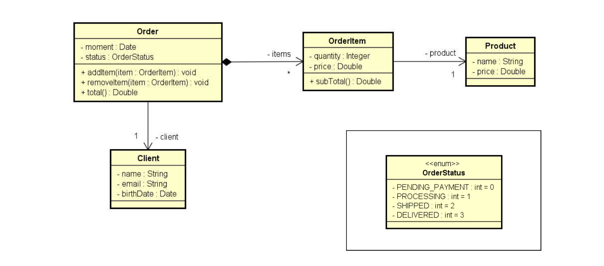
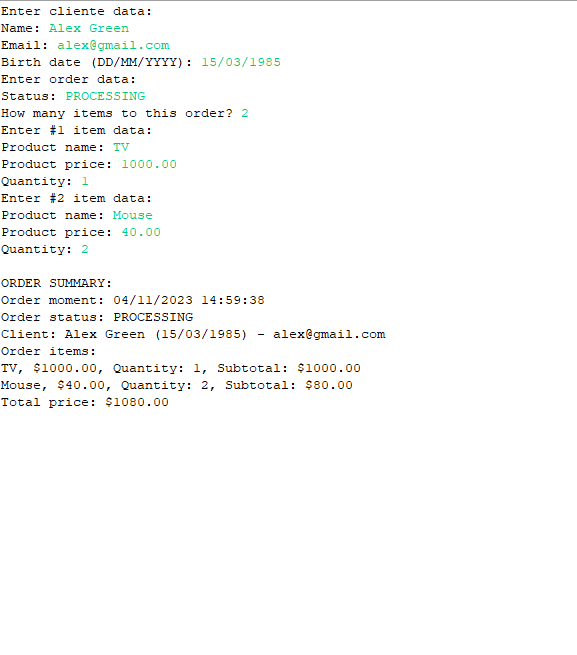

# Order_Summary
Read data from an order with N items (N provided by the user). Then show a order summary . The ordering time must be the system instant: new Date()

## UML

## Implementation

[WorkerLevel](https://github.com/ThiagSampaio/Salary_Calculation_Java/blob/main/Salary_Calculation/src/entities/WorkerLevel.java)

[Department](https://github.com/ThiagSampaio/Salary_Calculation_Java/blob/main/Salary_Calculation/src/entities/Department.java)

[HourContract](https://github.com/ThiagSampaio/Salary_Calculation_Java/blob/main/Salary_Calculation/src/entities/HourContract.java)

[Worker](https://github.com/ThiagSampaio/Salary_Calculation_Java/blob/main/Salary_Calculation/src/entities/Worker.java)

[Main](https://github.com/ThiagSampaio/Salary_Calculation_Java/blob/main/Salary_Calculation/src/applicaltion/Program.java)

## Result

